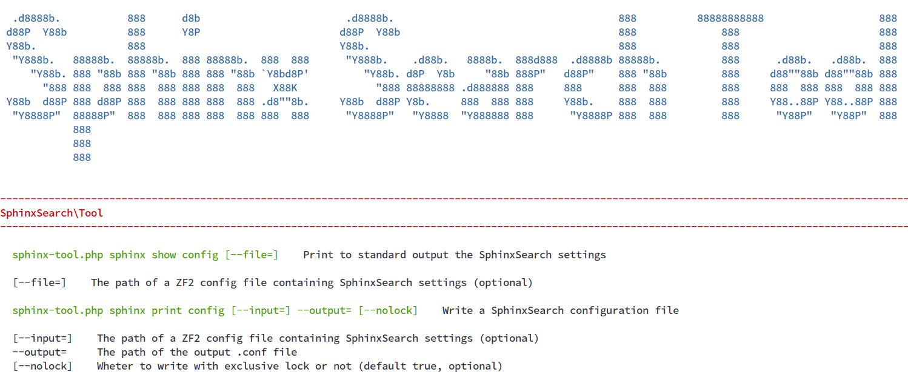

Sphinx Search Tool
==================



An utility that provides a set of tools to **create** and handle **Sphinx Search configurations** and **sources**.

The main purpose is to provide an automated way to build a Sphinx Search configuration starting from a ZF2 configuration.

Note tha this tool provides also a **variable substitutions mechanism** (see [here](#configuration)).

It runs from the command line as standalone CLI tool or can be installed as a ZF2 module.

## References

- [Sphinx Search configuration options](http://sphinxsearch.com/docs/current.html#conf-reference)

## Requirements
 * Zend Framework 2.0.0 or later
 * PHP 5.4.0 or later
 * Console access to the application being maintained (shell, command prompt)

## Installation

### Standalone installation using [composer](http://getcomposer.org)

 1. Open console (command prompt)
 2. `git clone https://github.com/ripaclub/zf2-sphinxsearch-tool.git`
 3. `cd zf2-sphinxsearch-tool`
 4. Run `composer install`

### Installation as ZF2 module using [composer](http://getcomposer.org)

 1. Open console (command prompt)
 2. Go to your application's directory
 3. Add the following to your **composer.json**

```json
{
    ...,
    "require": {
        "ripaclub/zf2-sphinxsearch-tool": "dev-develop"
    },
    "repositories": [
        {
        "type": "vcs",
        "url": "https://github.com/ripaclub/zf2-sphinxsearch-tool.git"
        }
    ]
}
```

 4. Run a `composer update`

## Usage

The entry point of the tool is the `sphinx-tool.php` file.

So executing it without commands, i.e. `php -f sphinx-tool.php`, the help message will be shown.

The usage of this tool is self-explanatory.

You can output (as array) to your console the Sphinx Search settings stored in the ZF2 configuration files (e.g. `module.config.php`) or in an external configuration file (e.g. `sphinx.conf.php`).

The Sphinx Search settings here specified will be merged with the default settings contained in ZF2 Sphinx Search Tool.

```bash
php -f sphinx-tool.php show config
php -f sphinx-tool.php show config --file=sphinx.conf.php
```

Also, you can directly write the configuration in the Sphinx Search format.

```bash
php -f sphinx-tool.php print config --output=config/sphinx.dev.conf
php -f sphinx-tool.php print config --input=sphinx.conf.php --output=config/sphinx.dev.conf
```

##### Note

If you use ZF2 Sphinx Search Tool as a module included into your application you can call its actions from your application entry point.

### Configuration

A Sphinx Search configuration can be defined via the `sphinxsearch` node element into you ZF2 configurations. The children of this node will be merged (i.e., added or substituted to) with defaults provided by ZF2 Sphinx Search Tool.

It can have this children:

- `variables`

    This node contains the variables that will be substituted into all your Sphinx Search configuration options.
    The default variables are `log_path`, `lib_path`, `run_path`, and `idx_path` (respectively set to `/var/log/sphinx/`, `/var/lib/sphinx`, `/var/run/sphinx/`, and `/var/idx/sphinx/`).
    You can define your variables (or override the defaults) and use them into your other settings wrapping them inside brackets.

- `searchd`

    Insert here your [search configuration options](http://sphinxsearch.com/docs/current.html#confgroup-searchd)

- `indexer`

    Insert here your [indexer configuration options](http://sphinxsearch.com/docs/current.html#confgroup-indexer)
    
- `common`

    Insert here you [common section configuration options](http://sphinxsearch.com/docs/current.html#confgroup-common)

- `indexes`

    This node contains the configurations of your indexes as an associative array which keys corresponds to index names.
    For each index you define you have to specify its [options](http://sphinxsearch.com/docs/current.html#confgroup-index)

- `sources`

    This node contains the configurations of you data source as an associative array which keys corresponds to source names.
    For each data source you define you have to specifiy its [options](http://sphinxsearch.com/docs/current.html#confgroup-source)
    
#### Example

An example of PHP array that defines a Sphinx Search configuration:

```php
return [
    'sphinxsearch' => [
        'variables' => [
            'idx_path' => '/path/to/idx/'
        ],
        'searchd' => [
            'listen' => '9306:mysql41',
            'log' => '{log_path}searchd.log',
            'query_log' => '{log_path}query.log',
            'pid_file' => '{run_path}searchd.pid',
            'workers' => 'threads',
            'binlog_path' => '{lib_path}',
            'sphinxql_state' => '{run_path}state.sql',
        ],
        'indexer' => [
            'mem_limit' => '512M',
            'write_buffer' => '16M',
        ],
        'indexes' => [
            'realtime' => [
                'type' => 'rt',
                'path' => '{idx_path}realtime',
                'rt_field' => 'title',
                'rt_field' => 'content',
                'rt_attr_uint' => 'gid',
            ],
            'main' => [
                'source' => 'main',
                'path' => '{idx_path}main',
            ],
            'delta : main' => [
                'source' => 'delta',
                'path' => '{idx_path}delta',
            ]
        ],
        'sources' => [
            'main' => [
                'sql_query_pre' => 'SET NAMES utf8',
                'sql_query_pre' => 'REPLACE INTO sph_counter SELECT 1, MAX(id) FROM documents',
                'sql_query' => 'SELECT id, title, body FROM documents WHERE id<=(SELECT max_doc_id FROM sph_counter WHERE counter_id=1)',
            ],
            'delta : main' => [
                'sql_query_pre' => 'SET NAMES utf8',
                'sql_query' => 'SELECT id, title, body FROM documents WHERE id>(SELECT max_doc_id FROM sph_counter WHERE counter_id=1)',
            ]
        ]
    ]
];
```

### Create data sources

...

---

[](https://github.com/igrigorik/ga-beacon)
